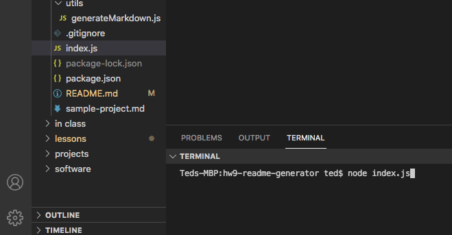
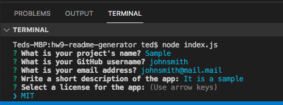
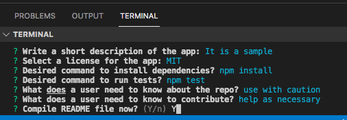
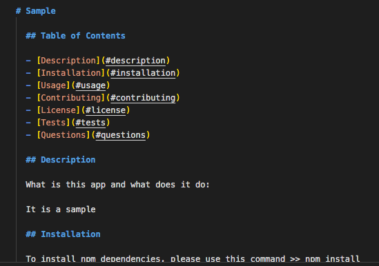

# hw9-readme-generator

Description:
 
The objective of this application is to function as a good README.md generator. It takes in user input such as project title, license used, etc. and incorporates this input into a pre-built skeleton. The final delivered product to the user is a README.md file that can be developed in less than a minute. It saves time and eliminates repetitive behavior. There is not a deployed URL associated with this app. 
 

Technologies Used:
 
Node.js is the main technology used in conjunction with the NPM Inquirer. Principles of markdown, Javascript, and Git were also used to develop the skeleton's framework.
 

Breakdown:
 
To initiate the app, the user must first pull this repo to their local level. There they should do a npm init -y and do npm install inquirer. In VSC's integrated terminal, type in node index.js and answer the prompts in the terminal when directed to do so. Upon typing Y as a final confirmation prompt, the user will be provided a README.md file that is named based upon whatever their project title is. It will go in the root level of whatever folder they are in. From there, the user can edit text as they see fit and push this README.md up to their app once they're ready to publish an app into a GitHub repo. 
 

Video Recording:
 
<!-- https://tedheikkila.github.io/hw9-readme-generator/ -->
 

Screenshots:
 
Folder path
 

 
Prompts (part 1)
 

 
Prompts (part 2)
 

 
Generated file
 
